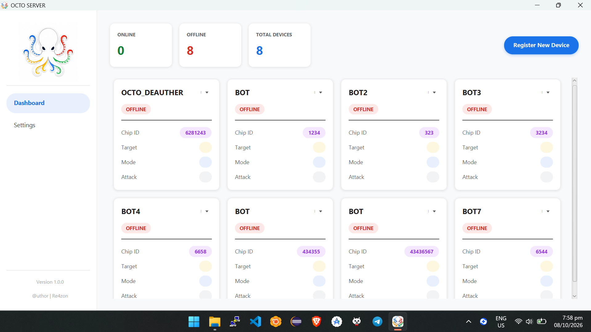
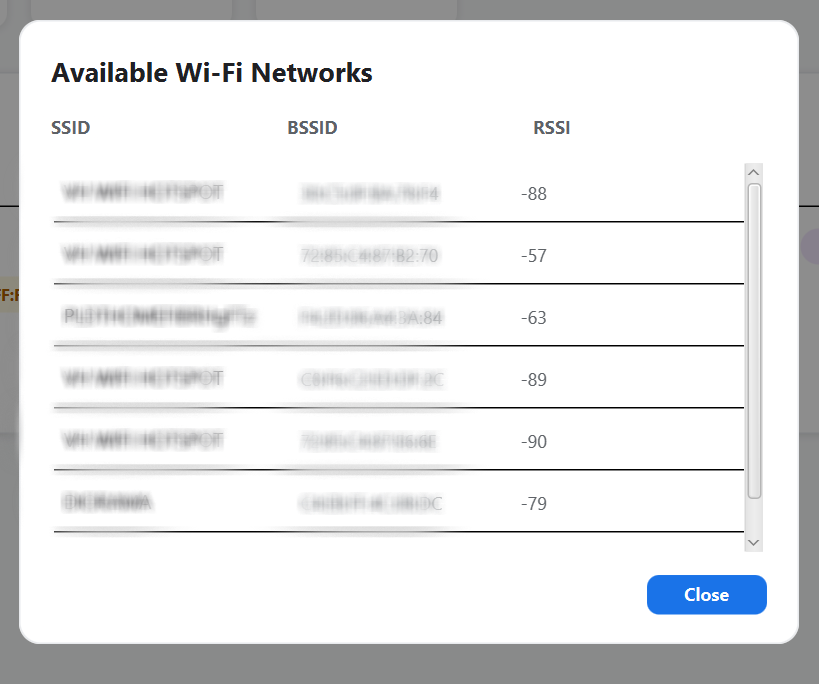

# Octo

<p align="center">
  
</p>

<p align="center">
  <strong>Server Type ESP8266 2.4 Ghz Wifi Deauther</strong>
</p>

<p align="center">
  
</p>

---

## About

**Octo** is an Esp8266 Deauther Server Type built around a client/server architecture.

The ESP8266 runs the Octo firmware and communicates with a centralized Octo Server through WebSocket. The system provides wireless network information, device monitoring, remote communication, and controlled deauthentication-frame testing for authorized environments.

The project was developed to explore:

* ESP8266 wireless capabilities
* Wi-Fi network discovery
* Wireless signal analysis
* Embedded networking
* WebSocket communication
* Remote ESP8266 device management
* Authorized wireless security testing

> **Important:** Octo's wireless testing functionality is intended only for networks and devices that you own or have explicit authorization to test.

---

# Features

### ESP8266

* Wi-Fi network scanning
* SSID discovery
* BSSID discovery
* RSSI / signal-strength monitoring
* Wi-Fi configuration
* WebSocket client
* Automatic server communication
* Persistent configuration
* Controlled deauthentication-frame testing for authorized environments

### Octo Server

* WebSocket server
* ESP8266 device management
* Device connection monitoring
* Online/offline status
* Remote device communication
* Real-time device updates
* Multiple ESP8266 client support
* Centralized wireless-testing control

---

# Architecture

Octo uses a client/server architecture.

```text
                         ┌──────────────────────────┐
                         │       OCTO SERVER        │
                         │                          │
                         │      WebSocket :8888    │
                         └────────────┬─────────────┘
                                      │
                       WebSocket      │
                                      │
              ┌───────────────────────┼───────────────────────┐
              │                       │                       │
              ▼                       ▼                       ▼
       ┌────────────┐          ┌────────────┐          ┌────────────┐
       │  ESP8266   │          │  ESP8266   │          │  ESP8266   │
       │   Octo #1  │          │   Octo #2  │          │   Octo #3  │
       └────────────┘          └────────────┘          └────────────┘
              │                       │                       │
              ▼                       ▼                       ▼
        Wi-Fi Testing           Wi-Fi Testing           Wi-Fi Testing
```

Each ESP8266 connects to the Octo Server through WebSocket.

The server maintains the connection and device state while the ESP8266 performs device-side wireless operations.

---

# Screenshots

## Octo Server



---

## Wi-Fi Scanner



---

# ESP8266 Installation

## Requirements

Before flashing Octo onto an ESP8266, you need:

* ESP8266 development board
* USB data cable
* Computer
* Python 3
* `esptool`
* Octo ESP8266 firmware `.bin` file

---

# 1. Install esptool

Install `esptool` using Python:

```bash
python -m pip install esptool
```

Verify the installation:

```bash
python -m esptool version
```

---

# 2. Connect the ESP8266

Connect the ESP8266 to your computer using a USB data cable.

Determine the serial port.

### Windows

Example:

```text
COM3
```

### Linux

Example:

```text
/dev/ttyUSB0
```

You can verify that the ESP8266 is accessible with:

```bash
python -m esptool --port COM3 chip-id
```

Replace `COM3` with the correct port.

---

# 3. Erase the ESP8266 Flash

> **Important:** The ESP8266 flash memory must be erased before installing the Octo firmware.

This removes previous firmware and stored flash data that could interfere with the installation.

### Windows

```bash
python -m esptool --port COM3 erase-flash
```

Example:

```bash
python -m esptool --port COM5 erase-flash
```

### Linux

```bash
python -m esptool --port /dev/ttyUSB0 erase-flash
```

Wait until `esptool` reports that the erase operation completed successfully.

---

# 4. Flash the Octo Firmware

After successfully erasing the flash, flash the Octo firmware.

Assuming the firmware is:

```text
octo-esp8266.bin
```

run:

```bash
python -m esptool --port COM3 write-flash 0x00000 octo-esp8266.bin
```

Example:

```bash
python -m esptool --port COM5 write-flash 0x00000 octo-esp8266.bin
```

Linux:

```bash
python -m esptool --port /dev/ttyUSB0 write-flash 0x00000 octo-esp8266.bin
```

> The firmware address must match the layout of the supplied firmware. If your release provides a different flashing address or multiple binary files, follow the release-specific flashing instructions.

After flashing completes, restart the ESP8266.

---

# 5. Configure the ESP8266

After the firmware starts, open the Octo ESP8266 setup interface.

The setup interface allows you to configure:

```text
Wi-Fi SSID
Wi-Fi Password

WebSocket Server
WebSocket Port
```

Example:

```text
Wi-Fi SSID:      MyNetwork
Wi-Fi Password:  ********

Server:          192.168.1.100
Port:            8888
```

Save the configuration and restart the ESP8266 if required.

---

# Octo Server

The Octo Server provides the central communication layer for ESP8266 devices.

The default WebSocket port is:

```text
8888
```


Using `0.0.0.0` allows the server to accept connections through the host's network interfaces.

---

# Wi-Fi Scanning

The ESP8266 can discover nearby wireless networks and report information to the Octo Server.

Typical information includes:

| Information | Description              |
| ----------- | ------------------------ |
| SSID        | Wireless network name    |
| BSSID       | Access-point MAC address |
| Channel     | Wireless channel         |
| RSSI        | Received signal strength |


Example:

```text
SSID:       ExampleNetwork
BSSID:      XX:XX:XX:XX:XX:XX
Channel:    6
RSSI:       -52 dBm
```

---


# Disclaimer

Octo is provided for educational, development, wireless research, and authorized security-testing purposes.

The developers are not responsible for misuse of this project or for damage, disruption, or loss resulting from unauthorized use.

**Only test wireless networks and devices that you own or have explicit permission to test.**

---

# License


```text
Copyright © 2026 Octo Project

All rights reserved.
```


